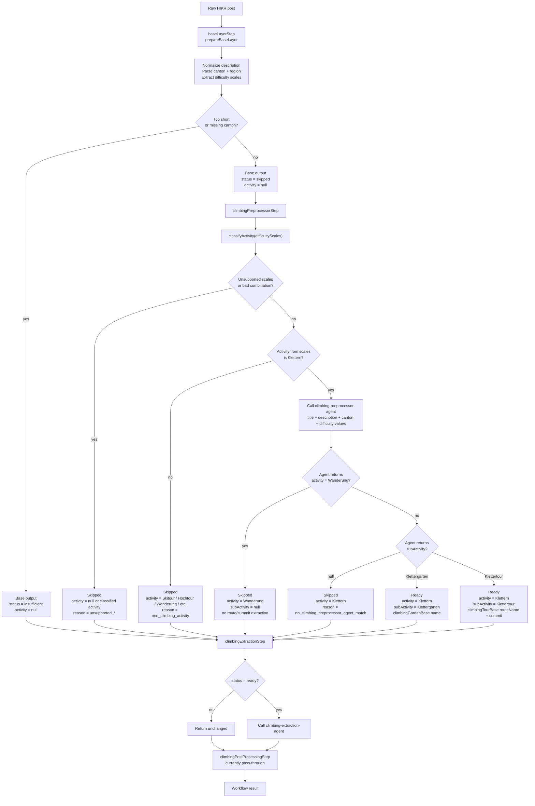
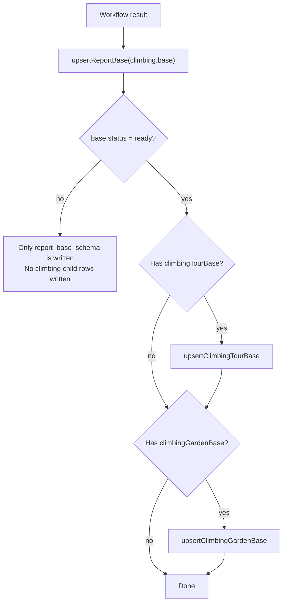

# Climbing Pipeline Workflow Overview

This is the current end-to-end flow for a HIKR post through the base layer and climbing pipeline.



## Persistence

Persistence happens outside the workflow, in the climbing pipeline service.



## Hiking Override

When the climbing preprocessor agent decides that hiking outweighs climbing, the climbing preprocessor returns early:

```ts
if (agentOutput.activity === ACTIVITY.HIKING) {
  return buildOutput({
    base: {
      ...base,
      activity: ACTIVITY.HIKING,
      status: PREPROCESSOR_STATUS.SKIPPED,
      subActivity: null,
    },
    reasons: ['non_climbing_activity'],
  });
}
```

The persisted `report_base_schema` row becomes:

```ts
status: 'skipped'
activity: 'Wanderung'
subActivity: null
reasons: ['non_climbing_activity']
```

Because `status !== ready`, the service does not write `climbing_tour_base_schema` or `climbing_garden_base_schema`.
